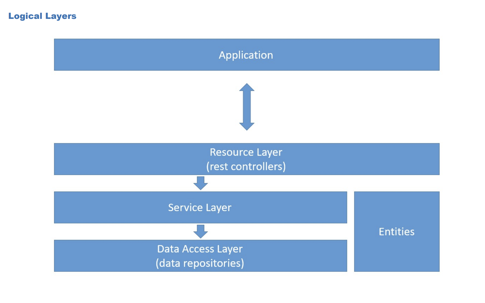

<strong>Arquitetura utilizada</strong>:<br/>
- ```Arquitetura em Camadas```

 <br/>

<strong>
Princípios SOLID, quando um serviço depende de outro (no caso TestConfig)
essa dependência tem que ser fraca, tem que ser desacoplada. <br/>
Feita por um construtor, ou no caso o framework, já faz isso automático.
</strong> <br/>
<br/>
<strong>
Camada de serviço foi implementada como camada intermediária para serem as regras de negócio
alguma orquestração de repostories. <br/>
Ex: Se tivesse sendo alugada alguma quadra, você vai querer verificar se ela está disponível,
salvar as informações da quadra e do pedido, então é melhor a camada de controlador
ser "enxuto" e as regras de negócio vão para camada de serviço.
</strong><br/>
<br/>
<strong>
A anotação @Service é usada para indicar que a classe UserService é um componente de serviço no contexto do Spring.
</strong> <br/>
<strong>
A anotação @Autowired é usada para injeção de dependências no Spring.
Exemplo: Com isso, o Spring automaticamente injeta uma instância de UserRepository nesta classe UserService no momento da inicialização.
</strong>
